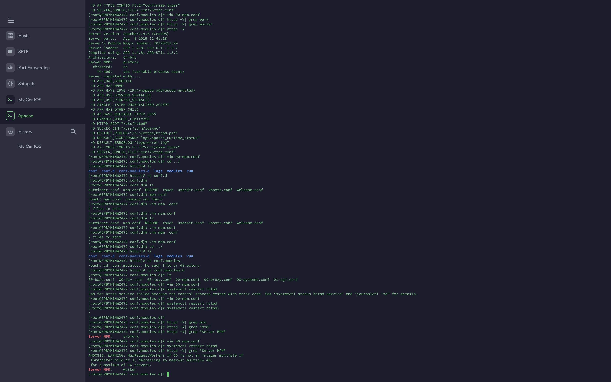
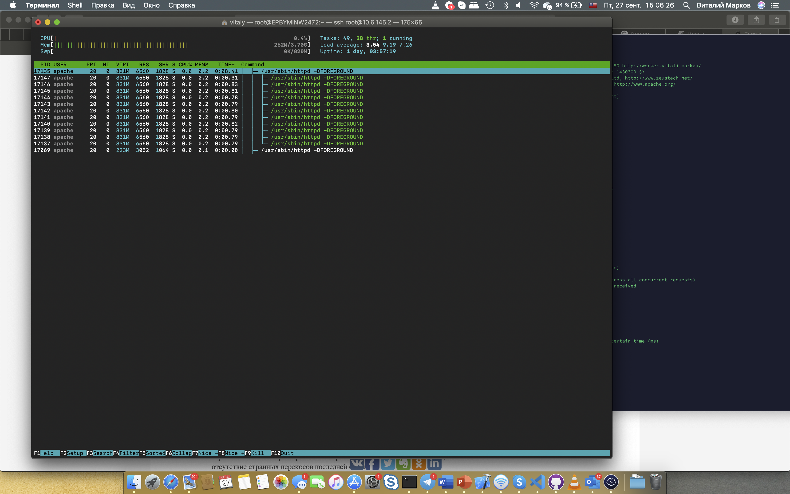
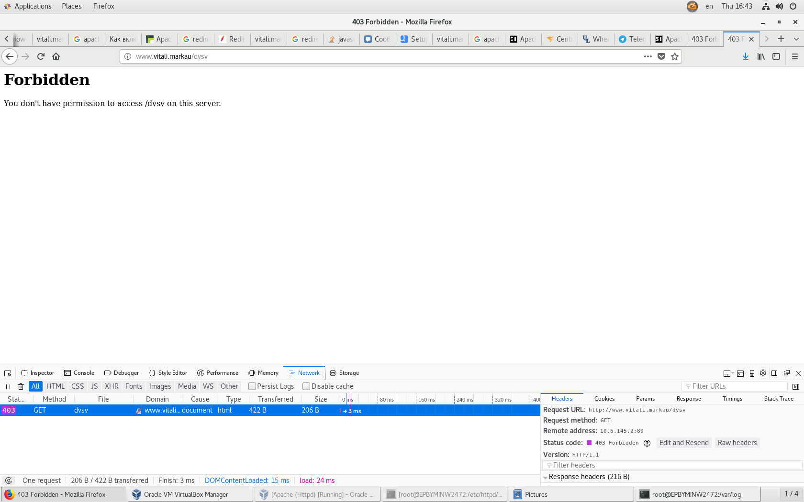
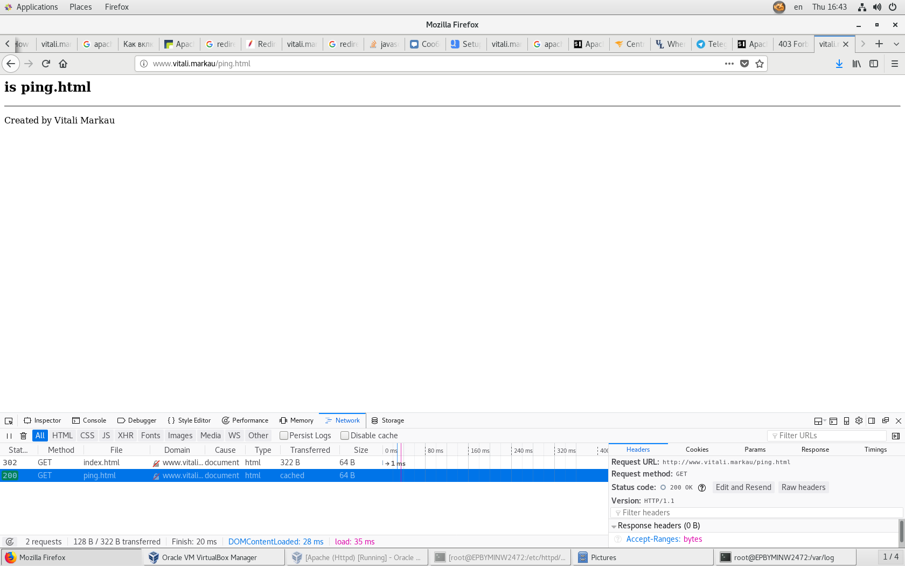
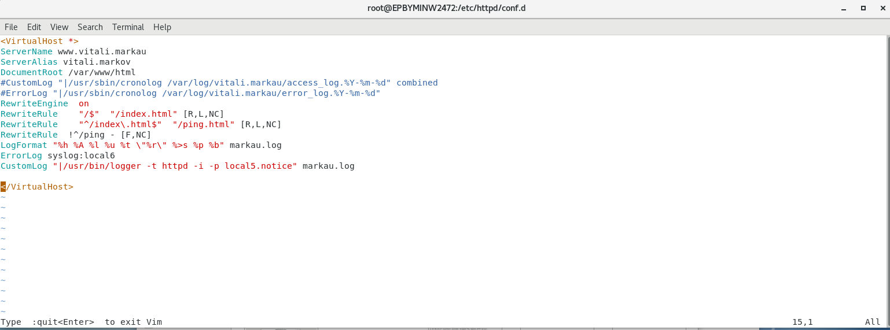

    Screenshots of test web pages being opened in browser 

    Screenshots of web server configurations used in tasks (virtual host, logging, etc.) 

Screenshots of output of web server checks, e.g. httpd -S 

    Screenshot of debug console to confirm mod_rewrite is working while opening / 

    Screenshot of debug console to confirm mod_rewrite is working while opening /index.html 

    Screenshot of debug console to confirm mod_rewrite is working while opening /none-existing-page 

    Screenshot of virtual host with cronolog configuration, output of tree command showing layout of log files created by cronolog 

    Screenshot of virtual host configuration with logging to syslog. Screenshots of syslog entries related to access/error web server logging. 
    
